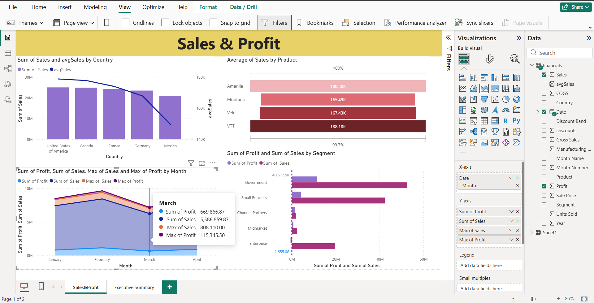
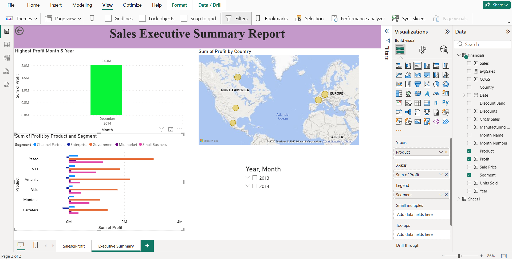
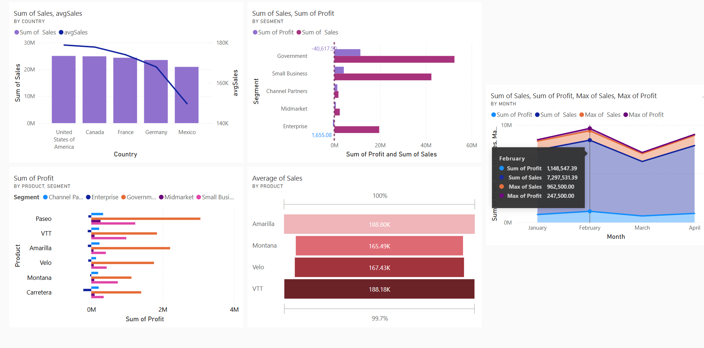

# Sales Data Exploration & Performance Analysis
## Project Overview
This project focuses on analyzing organizational sales data to provide an executive summary of financial performance. The dashboard is designed to help managers identify which regions, products, and segments are driving the most success.

## Key Visualizations & Analysis
- Geographic Performance: A comparison of total sales vs. average sales across different countries.

- Monthly Growth Tracker: A stacked area chart showing the relationship between profit and sales for the opening months of the year.

- Product Funnel: Analysis of product demand to determine which items require continued investment.

- Executive KPIs: Quick-glance metrics for the highest profit months and top-performing segments.

## Technical Implementation
- Data Transformation: Cleaned and structured sales records for accurate reporting.

- Advanced Visuals: Implementation of combined line/column charts and funnel visualizations for better data hierarchy.

- Business Logic: Created measures to identify minimum/maximum profit levels and average sales benchmarks.

## Tools Used
- Power BI Desktop
- Power Query (ETL)

